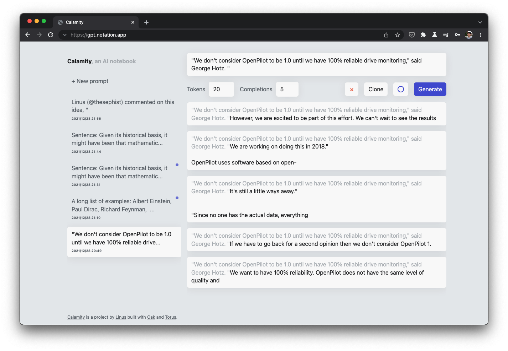

# Calamity 🌋

**Calamity** is a lightweight web app that wraps my custom (private) GPT-2 API to let me play and experiment with GPT language models easily. It runs [Huggingface transformers](https://huggingface.co/gpt2) wrappers of language models (currently `gpt2-large`, 775M parameters, because it's cheaper than GPT-3/J/Neo/XLNet/whatever else) behind a Flask / UWSGI API on the backend, and a [Torus](https://github.com/thesephist/torus)/[Oak](https://oaklang.org)-based frontend that wraps the API. The backend lives in `./services`, and the frontend + frontend server in `./src`.

The architecture here is a little weird. There are two independent web apps: the model and API server, and the web app that wraps and calls the API and serves the client user interface. It's designed this way so that the API itself can be reused across other apps in my personal infrastructure, some of which aren't public yet.

I personally run it on a reasonably-specced DigitalOcean VM behind an Nginx reverse proxy. Both the backend API service and the web app frontend run as systemd daemons. Currently, the API only lets the client customize generated sequence length and number, but I might add other parameters like temperature down the road.

## Development

Calamity is a web app written with [Oak](https://oaklang.org). To run and build Calamity, you'll need to install the `oak` binary.

Calamity's development is managed through a Makefile:

- `make serve` (default when just `make` is run) starts the web server at `src/main.oak`
- `make build` or `make b` builds the frontend from `src/app.js.oak`
- `make watch` or `make w` runs the frontend build while watching files for changes (using [entr](http://eradman.com/entrproject/))
- `make fmt` or `make f` re-formats all changed files tracked by Git. To format all files from scratch, run something like `oak fmt **/*.oak --fix`.
